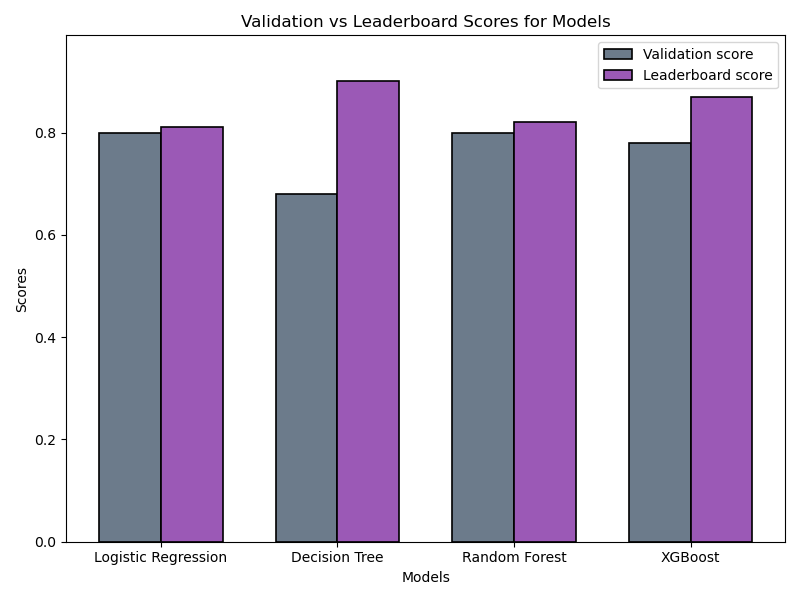

# Loan Prediction Practice Problem Repository

### Introduction
Welcome to the repository for the "Loan Prediction Practice Problem" project. This project involves analyzing and predicting loan approval status using various customer details. Below you will find the organized structure, detailed explanations, and code snippets for each step of the project workflow.

---

### Table of Contents
- [Project Summary](#project-summary)
- [Datasets](#datasets)
- [Data Dictionary](#data-dictionary)
- [Model Implementations](#model-implementations)
- [Model Performance](#model-performance)

---

### Project Summary
Dream Housing Finance provides home loan services to its customers and aims to automate the customer loan eligibility process. This project seeks to develop a model that predicts loan approval status based on various customer details.

#### Datasets
- **Training Data (train.csv):** Contains information about customers and their loan eligibility status.
  - Target Variable: Loan Status (Yes/No).
- **Test Data (test.csv):** Contains information about new customers.
  - Target Variable: Loan Status (Yes/No) will be predicted for this dataset.
- **Submission File (submission.csv):** Contains the predicted loan status for the test data.
  - Columns:
    - Loan_ID
    - Loan_Status

#### Data Dictionary
| Variable          | Description                                |
|-------------------|--------------------------------------------|
| Gender            | Male/Female.                              |
| Married           | Marital status.                           |
| Dependents        | Number of dependents.                     |
| Education         | Graduate/Undergraduate education.         |
| Self_Employed     | Self-employment status.                   |
| ApplicantIncome   | Income of the applicant.                  |
| CoapplicantIncome | Income of the co-applicant.               |
| LoanAmount        | Loan amount requested.                    |
| Loan_Amount_Term  | Loan repayment term (in months).          |
| Credit_History    | Credit payment history.                   |
| Property_Area     | Urban, Semi-Urban, or Rural area.         |
| Loan_Status       | Was the loan approved? (Yes/No).          |

---

### Exploratory Data Analysis (EDA)

#### 1. Data Examination
Initially, the dataset was examined. The `train.head()` and `train.info()` functions were used to check the columns, data types, and missing values.

#### 2. Handling Missing Values
Missing values were imputed using appropriate strategies:
- **Categorical variables** (e.g., `Gender`, `Married`, `Dependents`, `Self_Employed`, `Credit_History`) were filled with the `mode` (the most frequent value).
- **Numerical variables**: The `Loan_Amount_Term` variable was filled with the `mode`.
- Missing values in the `LoanAmount` variable were filled using the **median** to reduce the impact of outliers.

#### 3. Handling Outliers
Outliers and right skewness in the `LoanAmount` variable were identified. A **log transformation** was applied to address these issues.

#### 4. Final Status
All missing values were filled, and outliers were treated. The dataset was prepared to be more suitable for modeling.

For more details on the steps taken and the procedures applied, you can access the notebook [here](1-loan-status-prediction-eda-and-model-implementation.ipynb).

---

## Model Implementations

For this project, we explored multiple machine learning models. You can access the detailed implementations through the following links:

- [Logistic Regression](#)
- [Decision Tree](#)
- [Random Forest](#)
- [XGBoost](#)

## Model Performance

We evaluated the performance of the four models, and our analysis indicates that Logistic Regression and Random Forest performed the best in terms of validation scores and leaderboard scores.

| Model               | Validation Score | Leaderboard Score |
|---------------------|------------------|-------------------|
| Logistic Regression | 0.80            | 0.84    |
| Decision Tree       | 0.68            | 0.90    |
| Random Forest       | 0.80            | 0.85    |
| XGBoost             | 0.78            | 0.87    |

**Logistic Regression** and **Random Forest** emerged as the top-performing models, making them the most reliable choices for predicting loan approval status.

---

### Acknowledgments

This project is inspired by the practice problem available on [Analytics Vidhya](https://www.analyticsvidhya.com/).
